## 一、所需材料及准备工作

### 1、材料

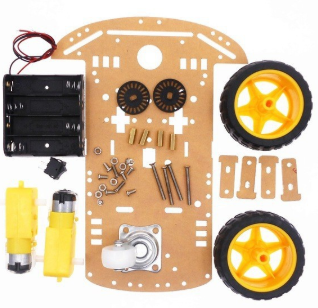

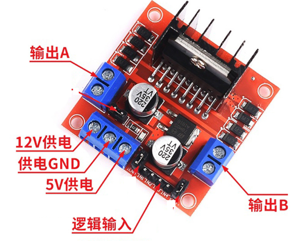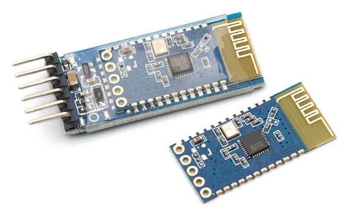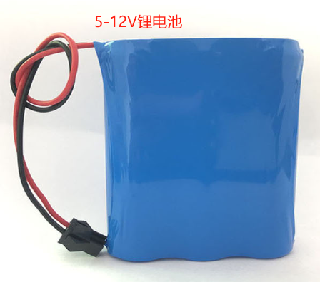


### 2、软件安装

串口软件，用于下载程序，串口调试蓝牙使用

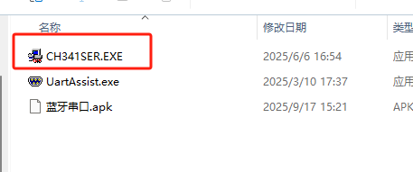

## 二、接线图

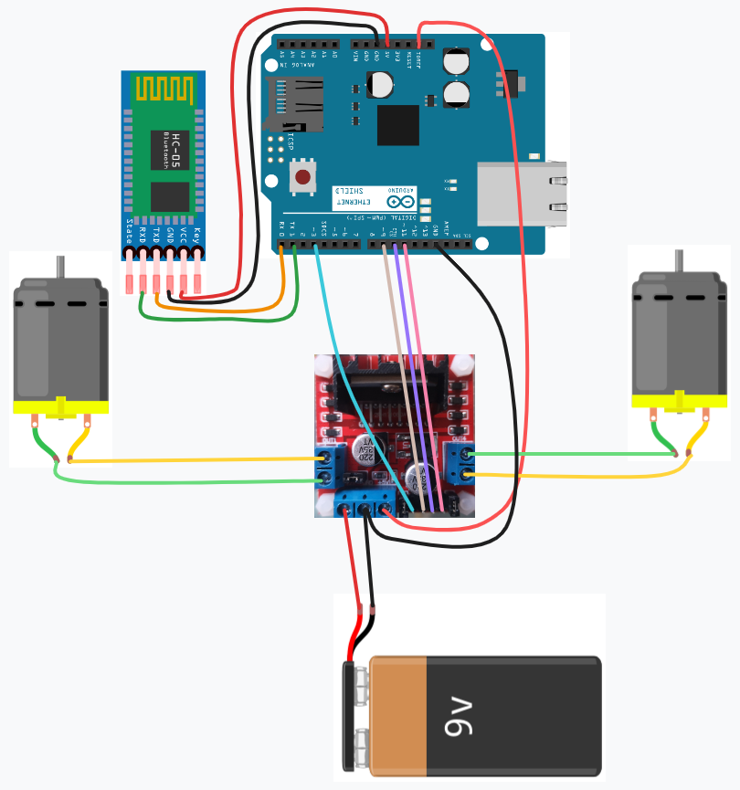

### 1、Arduino开发板与蓝牙接线

rx、tx分别与tx、rx连接，vcc接3.3v或5V，GND接GND

### 2、开发板与L298N电机驱动

开发板3、9、10、11与L298N逻辑输入连接。VCC接5V，GND接GND

### 3、电源与L298N

5-12V电源都可以，最好采用锂电池，能量密度大

电源正极接供电引脚，GND接GND

### 4、电机与L298N

电机分别接入2侧的输出A、输出B

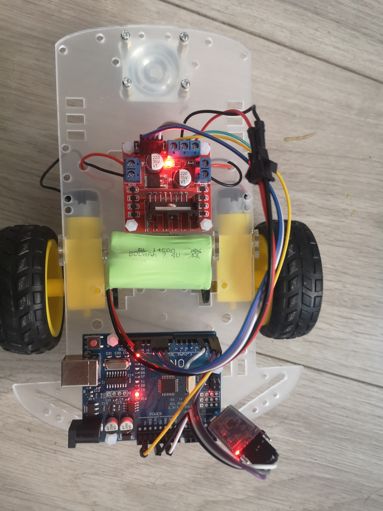

## 三、蓝牙的调试

### 1、简介

JDY-31 仅支持从模式，可以先打开手机蓝牙，密码1234，或无密码是否能登录上，如果可以，省略此步骤。

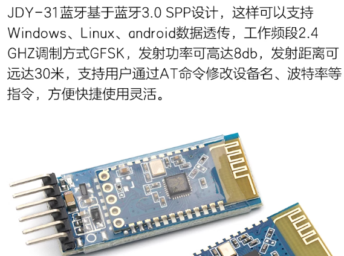

### 2、蓝牙 连接 USB转串口

连接的时候，rx、tx交叉连接

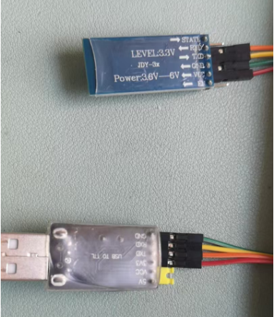

USB转串口接电脑，打开串口软件

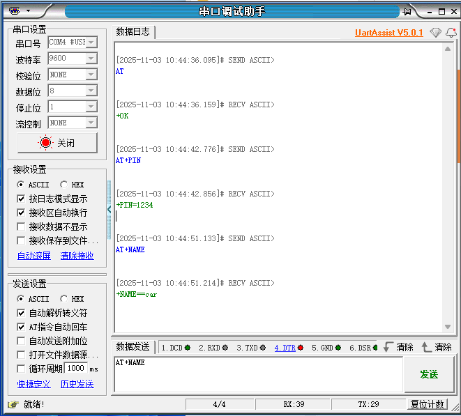

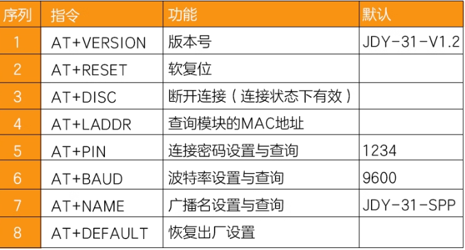

输入AT，返回OK，表示连接成功

输入AT+NAME，显示名字，AT+NAME=CAR，表示修改名字为CAR

输入AT+BAUD，显示波特率，AT+BAUD=9600，表示修改波特率9600，查询的情况波特率=4，代表9600，默认9600，最好不要改。

。。。。。。

## 四、程序编写

```c
//电机引脚设置//
#define leftA_PIN 3
#define leftB_PIN 9
#define rightA_PIN 10
#define rightB_PIN 11

// 蓝牙传入的串行数据
int incomingByte = 0;   

//函数声明
void motor_init(void); //电机初始化
void forward(void);   //向前   1
void back(void);   //向后  2
void turnLeftOrigin(void);  //原地左转 8
void turnRightOrigin(void);   //原地右转 9
void turnRightforward(void);  //右前  5
void turnLeftforward(void) ;   //左前  4
void turnRightback(void) ;  //右后 7
void turnLeftback(void) ;  //左后  6
void stop(void);  //停止  3

void setup() {
  Serial.begin(9600);  // 打开串口，设置数据传输速率9600
  motor_init();  //电机初始化
}

void loop() {
  // 当你接收数据时发送数据
  if (Serial.available() > 0) {
    // 读取传入的数据:
    incomingByte = Serial.parseInt();
    //使用switch语句对接收到的数据进行判断、执行
    switch(incomingByte)
    {
      case 1:  //接收到1，前进500ms，停止
      {forward();delay(500);stop();break;}
      case 2:  //接收到2，后退500ms，停止
      {back();delay(500);stop();break;}
      case 3:  //接收到3，停止
      {stop();break;}
      case 4:  //接收到4，左前500ms，停止
      {turnLeftforward();delay(500);stop();break;}
      case 5:  //接收到5，右前500ms，停止
      {turnRightforward();delay(500);stop();break;}
      case 6:  //接收到6，左后500ms，停止
      {turnLeftback();delay(500);stop();break;}
      case 7:  //接收到7，右后500ms，停止
      {turnRightback();delay(500);stop();break;}    
      case 8:  //接收到8，原地左转500ms，停止
      {turnLeftOrigin();delay(500);stop();break;}    
      case 9:  //接收到9，原地右转500ms，停止
      {turnRightOrigin();delay(500);stop();break;}    
    }
  }
}

//电机初始化
void motor_init(void)
{
  // 电机初始化，两个电机需要4个pwm
  pinMode(leftA_PIN,OUTPUT);
  pinMode(leftB_PIN,OUTPUT);
  pinMode(rightA_PIN,OUTPUT);
  pinMode(rightB_PIN,OUTPUT);
}

//向前
void forward(void) {
  analogWrite(leftA_PIN,100);
  analogWrite(leftB_PIN,10);
  analogWrite(rightA_PIN,100);
  analogWrite(rightB_PIN,10);
}

//向后
void back(void) {
  analogWrite(leftA_PIN,10);
  analogWrite(leftB_PIN,100);
  analogWrite(rightA_PIN,10);
  analogWrite(rightB_PIN,100);
}

//原地左转
void turnLeftOrigin(void) {
  analogWrite(leftA_PIN,10);
  analogWrite(leftB_PIN,120);
  analogWrite(rightA_PIN,120);
  analogWrite(rightB_PIN,10);
}

//原地右转
void turnRightOrigin(void) {
  analogWrite(leftA_PIN,120);
  analogWrite(leftB_PIN,10);
  analogWrite(rightA_PIN,10);
  analogWrite(rightB_PIN,120);
}

//右前
void turnRightforward(void) {
  analogWrite(leftA_PIN,200);
  analogWrite(leftB_PIN,10);
  analogWrite(rightA_PIN,100);
  analogWrite(rightB_PIN,10);
}

//左前
void turnLeftforward(void) {
  analogWrite(leftA_PIN,100);
  analogWrite(leftB_PIN,10);
  analogWrite(rightA_PIN,200);
  analogWrite(rightB_PIN,10);
}

//右后
void turnRightback(void) {
  analogWrite(leftA_PIN,10);
  analogWrite(leftB_PIN,200);
  analogWrite(rightA_PIN,10);
  analogWrite(rightB_PIN,100);
}

//左后
void turnLeftback(void) {
  analogWrite(leftA_PIN,10);
  analogWrite(leftB_PIN,100);
  analogWrite(rightA_PIN,10);
  analogWrite(rightB_PIN,200);
}

//停止
void stop(void) {
  analogWrite(leftA_PIN,10);
  analogWrite(leftB_PIN,10);
  analogWrite(rightA_PIN,10);
  analogWrite(rightB_PIN,10);
}

```

## 五、蓝牙APP调试

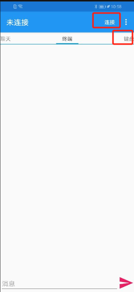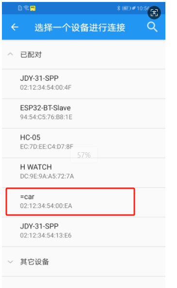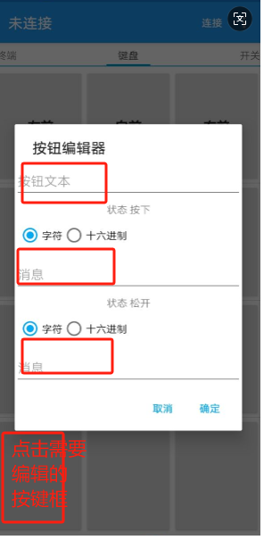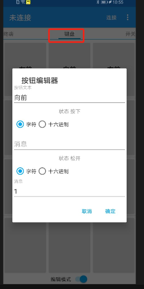
