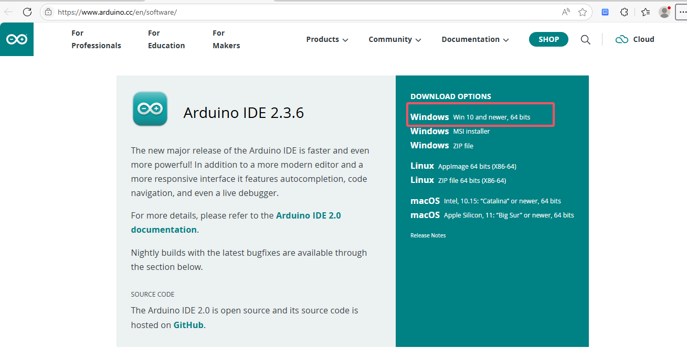
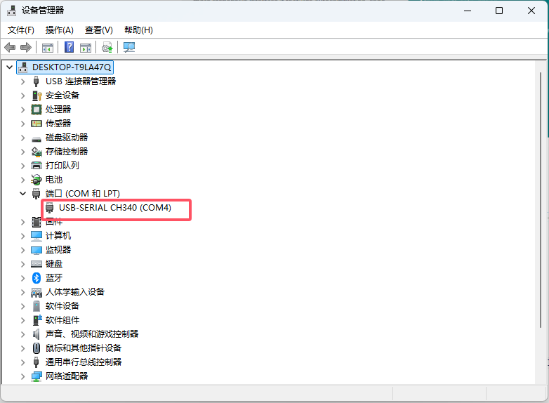
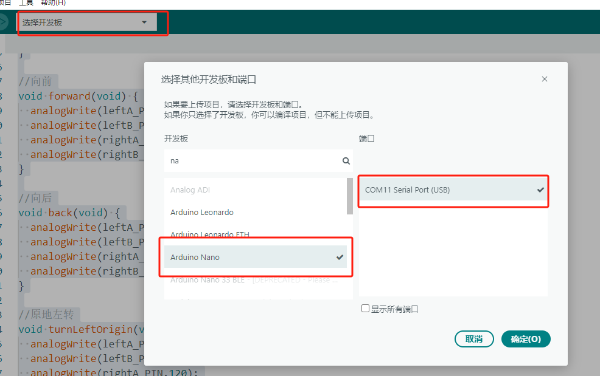

#  **Arduino IDE开发环境的搭建**

### 一、开发环境的删除

主要对应的先前安装过开发环境，第一次安装请跳过

**Windows 系统**

1. **通过控制面板卸载**

   - 打开 **控制面板** > **程序** > **程序和功能**。
   - 找到 **Arduino IDE**，右键选择 **卸载**，按提示完成卸载。

2. **删除残留文件**

   - 删除安装目录（默认路径：`C:\Program Files (x86)\Arduino` 或 `C:\Program Files\Arduino`）。
   - 删除用户数据文件夹：`C:\Users\你的用户名\AppData\Local\Arduino15` `C:\Users\你的用户名\AppData\Roaming\Arduino`

3. **清除注册表（高级操作）**

   - 按下 `Win + R` 打开运行窗口，输入 `regedit` 打开注册表编辑器。

   - 搜索并删除所有与 **Arduino** 相关的注册表项（如 `HKEY_CURRENT_USER\Software\Arduino` `HKEY_LOCAL_MACHINE\SOFTWARE\Arduino`）。
     **注意**：错误修改注册表可能导致系统问题，请谨慎操作。

     ------

     

### 二、开发环境的安装

#### **1.  Arduino IDE安装**

1. 软件下载 [Arduino 官网](https://www.arduino.cc/en/software)

2. 中文设置

   **选择语言**

   - 首次启动时，IDE 会自动检测系统语言，或在顶部菜单选择 **File → Preferences → Language**。

 				如果不能从国外网站安装，请使用离线安装

#### **2. CH340/CH341 驱动（常见于国产 Arduino 克隆板）**

如果你的开发板使用 CH340 芯片（如 Nano、Mini 板），Windows 可能无法自动识别，需要手动安装驱动：

1. 下载驱动
   - 访问 [WCH 官网驱动下载页](https://www.wch.cn/downloads/CH341SER_ZIP.html)，下载 `CH341SER.ZIP`。
2. 安装驱动
   - 解压文件，双击 `SETUP.EXE` 并按提示完成安装。
3. 验证安装
   - 连接 Arduino，在 **设备管理器 → 端口 (COM 和 LPT)** 中查看是否出现 `USB-SERIAL CH340 (COMX)`。

### 三、常见问题

1. **IDE 无法启动**
   - 确保系统满足最低要求（Windows 7 或更高版本）。
   - 尝试以管理员身份运行。
2. **提示 Java 错误**
   - Arduino IDE 基于 Java，若缺少 Java 环境，需安装 [Java Runtime Environment (JRE)](https://www.java.com/en/download/)。
3. **杀毒软件阻止**
   - 临时禁用杀毒软件或添加 Arduino IDE 到信任列表。

### 四、**验证安装**

1. **连接 Arduino 板**
   - 使用 USB 线将 ESP8266连接到电脑。
2. **选择开发板和端口**
   - 在 IDE 中，点击：
     - **工具 → 开发板** → 选择对应型号。
     - **工具 → 端口** → 选择识别到的 COM 端口（如 `COM11`）。

